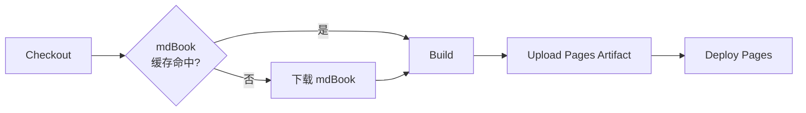

# CI / CD

模板包含一个 GitHub Actions 工作流，用于自动构建 mdbook 文档并部署到 GitHub Pages。

## 工作流文件

`.github/workflows/deploy-mdbook.yml`

## 触发条件

```yaml
on:
  push:
    branches: [main]
  workflow_dispatch:      # 也支持手动触发
```

## 工作流结构



### 1. Checkout

使用 `actions/checkout@v4` 拉取仓库代码。

### 2. 缓存

使用 `actions/cache@v4` 缓存 `/usr/local/bin/mdbook`，key 为 `mdbook-v0.4.52`。缓存命中时跳过下载，后续构建秒级完成。

### 3. Build

执行 `mdbook build docs`，产物输出到 `docs/book/`。

### 4. Upload Artifact

使用 `actions/upload-pages-artifact@v3` 将 `docs/book/` 上传为 Pages 产物。

### 5. Deploy

使用 `actions/deploy-pages@v4`（GitHub 官方部署 action）直接部署，无需 `gh-pages` 分支。

## 权限配置

```yaml
permissions:
  contents: read
  pages: write
  id-token: write
```

比旧的 `contents: write` 更精细、更安全。同时使用 `concurrency` 防止重复部署。

## 启用 GitHub Pages

1. 仓库 **Settings → Pages**
2. **Source** 选择 **GitHub Actions**（而非 "Deploy from a branch"）
3. 保存即可

首次推送 `main` 后，Actions 会自动构建并部署。部署成功后，站点地址为 `https://<user>.github.io/<repo>/`。
